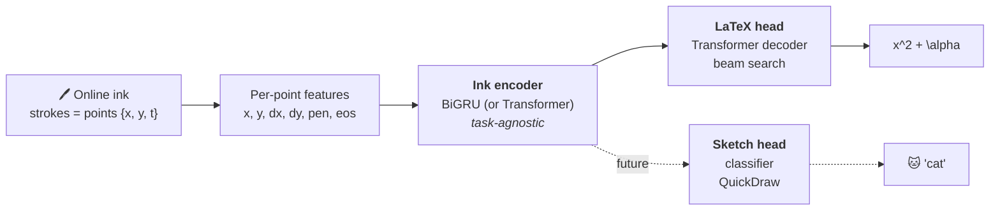

<div align="center">

# 🪨 Rosetta — Handwritten Math → LaTeX

**Write math by hand. Get LaTeX back. See the result.**

*Online handwritten mathematical expression recognition from raw pen trajectory
(ink, not images), in the spirit of the iPad's Math Notes — trained locally with a seq2seq model.*


</div>

---

## 🎯 What it does

You draw on a canvas; the system consumes the **raw sequence of pen points** (not an
image!) and returns **normalized LaTeX** — plus, when it makes sense, the computed
result via SymPy.

**Real pipeline example** (CROHME ink → HTTP → model → LaTeX, verified end-to-end):

```
ink (23 strokes, ~800 points)  ──►  POST /recognize  ──►

S = \Bigg ( \sum _ { i = 1 } ^ { n } \theta _ i - ( n - 2 ) \pi \Bigg ) r ^ 2
```

And `/evaluate` solves what can be solved:

| You write | SymPy answers |
|---|---|
| `\frac{3}{4} + \frac{1}{4}` | `1` |
| `\sqrt{16} + 2^3` | `12` |
| `2x + 4 = 10` | `x = 3` |

## 🧠 Architecture: one encoder, multiple heads

The core design decision: **the input and the encoder are task-agnostic**. The same
ink encoder that reads math will, in Phase 4, classify QuickDraw-style sketches —
just by swapping the output head.



There is **one single ink contract** (`schemas/ink.schema.json`), mirrored in
TypeScript (web), Pydantic (api), and dataclasses (ml) — training and inference use
the exact same representation.

## 📊 Status & results

| Phase | Deliverable | Status |
|---|---|---|
| **0** | Scaffold, InkML→tensors, LaTeX tokenizer, ink schema | ✅ |
| **1** | seq2seq proof: overfit on 32 real CROHME samples | ✅ `exact_match = 1.0`, `cer = 0.0` |
| **2** | Augmentation, beam search, full CROHME training (8.9k) | 🔄 training (RTX 5050, AMP) |
| **3** | `/recognize` API + canvas + KaTeX + SymPy `/evaluate` | ✅ verified end-to-end |
| **4** | Sketch classification head (QuickDraw) | 🔜 |

Details in [`docs/roadmap.md`](docs/roadmap.md) · decisions in [`docs/adr/`](docs/adr).

## 🚀 Try it in 2 minutes (no dataset download)

The repo ships a synthetic ink generator — enough to prove the whole pipeline
(data → training → inference) with zero downloads:

```bash
# deps (uv) — or use a venv with torch, numpy, pyyaml
uv sync

# 1. generate 32 expressions as synthetic InkML
python -m hmer_ml.data.synth --out data/synth --n 32

# 2. train until it memorizes (~2 min on GPU; also works on CPU)
python -m hmer_ml.train --config ml/configs/overfit_synth.yaml

# 3. evaluate: exact_match = 1.0 expected
python -m hmer_ml.evaluate --config ml/configs/overfit_synth.yaml \
    --ckpt checkpoints/overfit_synth/last.ckpt
```

> 💡 Without `uv sync`, run with `PYTHONPATH=ml/src`. RTX 50xx GPUs (Blackwell) require
> the **cu128** PyTorch build: `pip install torch --index-url https://download.pytorch.org/whl/cu128`.

## 🖥️ Running the full app

```bash
# Terminal 1 — API (from repo root)
export HMER_CKPT=checkpoints/crohme/last.ckpt
export HMER_CONFIG=ml/configs/crohme.yaml
uvicorn hmer_api.main:app --port 8000

# Terminal 2 — Web
cd web && npm install && npm run dev
# → http://localhost:3000  (draw something!)
```

Without `HMER_CKPT` the API starts in stub mode (HTTP 501) — handy for building the
frontend against the contract before a model is trained.

## 🏋️ Training on real data

```bash
# CROHME (~9k expressions; see docs/datasets.md for download)
python -m hmer_ml.train --config ml/configs/crohme.yaml       # AMP + bucketing + augment
python -m hmer_ml.evaluate --config ml/configs/crohme.yaml \
    --ckpt checkpoints/crohme/last.ckpt --root data/crohme/valid --beam 4
```

Built for **a single laptop GPU (6–8 GB)**: mixed precision, gradient accumulation,
length bucketing, and checkpointing with **automatic resume** — interrupt with
`Ctrl+C` and pick up right where it left off with the same command.

| Dataset | Samples | Role |
|---|---|---|
| [MathWriting](https://github.com/google-research/google-research/tree/master/mathwriting) (Google, 2024) | ~230k human + 400k synthetic | primary (Phase 2+) |
| [CROHME](https://www.kaggle.com/datasets/ntcuong2103/crohme2019) (2011–2019) | ~8.9k train + 2014/16/19 test sets | fast validation / benchmark |

## 📁 Monorepo layout

```
├── ml/          # PyTorch: data (InkML), tokenizer, encoder/heads, training, beam search
│   ├── configs/ #   YAML with inheritance (_base_) — scale the model without touching code
│   └── tests/   #   19 tests (data pipeline, model, augmentation)
├── api/         # FastAPI: POST /recognize (ink→LaTeX), POST /evaluate (SymPy)
│   └── tests/   #   8 tests (contract, SymPy, integration with the real model)
├── web/         # Next.js: canvas with PointerEvents → proxy → KaTeX render
├── schemas/     # ink.schema.json — single ink contract (web = api = ml)
└── docs/        # vision, datasets, roadmap, and ADRs (architecture decisions)
```

## 🔩 Architecture decisions (ADRs)

| # | Decision | Why |
|---|---|---|
| [0001](docs/adr/0001-online-ink-input.md) | Online ink, not images | trajectory beats pixels for handwriting; native InkML datasets |
| [0002](docs/adr/0002-encoder-recurrent-vs-transformer.md) | BiGRU by default, Transformer optional | fits in 6–8 GB VRAM; swappable via config |
| [0003](docs/adr/0003-custom-latex-tokenizer.md) | Custom LaTeX tokenizer | `\frac` is one token; closed vocab from the dataset |
| [0004](docs/adr/0004-shared-ink-schema.md) | Single shared ink schema | training and inference use the same representation |
| [0005](docs/adr/0005-python-dependency-uv.md) | uv workspace | Python monorepo with a reproducible lockfile |
| [0006](docs/adr/0006-pluggable-heads.md) | Encoder + pluggable heads | sketch extensibility is a requirement, not a promise |

## 🗺️ Roadmap

- [ ] Finish full CROHME training and report CER/exact-match on the 2019 test set
- [ ] Scale up to MathWriting (config ready)
- [ ] Phase 4: sketch classification head + QuickDraw, reusing the encoder
- [ ] Future: multimodal fusion (ink + rendered image) and LLM-based output refinement
